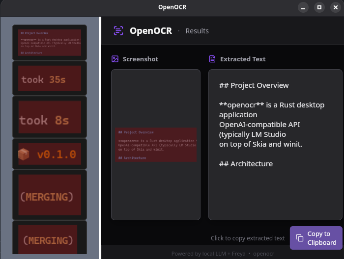

# openocr

A lightweight desktop OCR tool built with Rust. Select any region of your screen, and openocr captures it, sends it to a local LLM via [LM Studio](https://lmstudio.ai/), and returns the extracted text -- all running locally on your machine.

Built with [Freya](https://github.com/marc2332/freya), a native Rust GUI framework powered by Skia and winit.



## How It Works

1. **Launch** -- openocr creates a transparent fullscreen overlay on each connected monitor
2. **Select** -- click and drag to draw a selection rectangle over the text you want to extract
3. **Extract** -- the selected region is captured, cropped, and sent to a vision-capable LLM running in LM Studio
4. **Result** -- a new window appears with the extracted text and the captured screenshot, plus a button to copy the text to your clipboard
5. **Exit** -- press `ESC` at any time to quit

## Prerequisites

- **Rust** (edition 2024) -- install via [rustup](https://rustup.rs/)
- **LM Studio** running locally with a vision-capable model loaded (default: `allenai/olmocr-2-7b`)
- **Linux** with X11 (screen capture uses `xcap`)

## Installation

```sh
git clone https://github.com/aspnxdd/openocr.git
cd openocr
cargo build --release
```

## Usage

Make sure LM Studio is running with a vision model loaded, then:

```sh
# Run with defaults
cargo run --release

# Specify a different model
cargo run --release -- --model "your-model-name"

# Use a different API endpoint
cargo run --release -- --url "http://localhost:8080/v1"

# Disable screenshot display in the result window
cargo run --release -- --display-screenshot false
```

### CLI Options

| Flag                   | Short | Default                    | Description                                       |
| ---------------------- | ----- | -------------------------- | ------------------------------------------------- |
| `--model`              | `-m`  | `allenai/olmocr-2-7b`      | LLM model name for OCR                            |
| `--url`                | `-u`  | `http://localhost:1234/v1` | OpenAI-compatible API base URL                    |
| `--display-screenshot` | `-d`  | `true`                     | Show the captured screenshot in the result window |

## Key Dependencies

| Crate                                         | Role                                   |
| --------------------------------------------- | -------------------------------------- |
| [freya](https://github.com/marc2332/freya)    | GUI framework (Skia + winit)           |
| [xcap](https://crates.io/crates/xcap)         | Screen capture and monitor enumeration |
| [rig-core](https://crates.io/crates/rig-core) | LLM client (OpenAI-compatible API)     |
| [image](https://crates.io/crates/image)       | Image cropping                         |
| [clap](https://crates.io/crates/clap)         | CLI argument parsing                   |
| [tokio](https://crates.io/crates/tokio)       | Async runtime                          |

## Development

```sh
# Format Rust and TOML files
just f

# Build in debug mode
cargo build

# Run in debug mode
cargo run
```

## License

MIT
